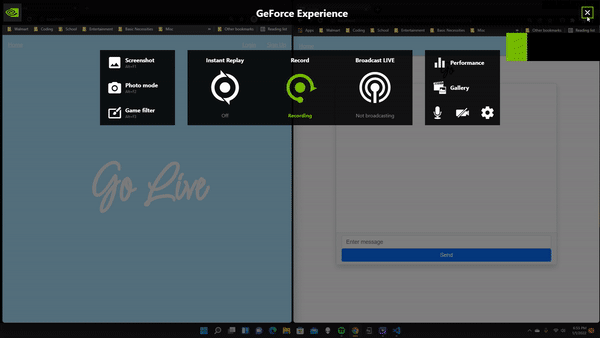

# Go Live Chatrooms

An example project demonstrating websockets and authentication using Golang and React.js with Typescript.

## Preview

[Click here to watch on YouTube](https://youtu.be/VtCIdvlczQA)

## Features

- Go with Gin Gonic, Melody, and Gorm.io
- React.js with SASS and Bootstrap 5
- PostgreSQL
- Webpack Live Hot Reloading
- Authentication with JWT
- Websockets with Melody

## Installation

Check out the docs for setup: <a href="./docs/INSTALLATION.md">Click here</a>
